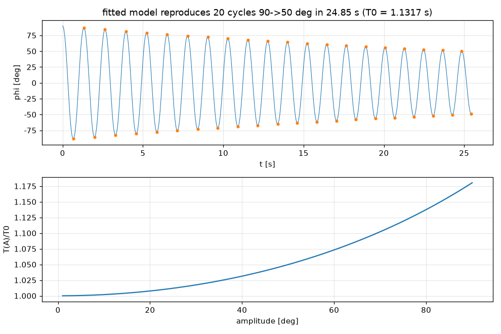

# 02 物理建模与参数辨识

## 2.1 坐标与符号约定（全软件统一）

- $x$：小车位置 [m]，以导轨中点为 0，**正方向 = 电机正速度指令使小车运动的方向**（docs/05 第 4 步实测定义）。
- $\theta$：摆角 [rad]，**从竖直向上量起**，杆向 $+x$ 一侧倾斜时为正。下垂位置 $\theta=\pm\pi$。
- $a=\ddot x$：小车加速度 [m/s²]，即控制输入。
- $m, l_c, J$：摆杆质量、质心到支点距离、对支点的转动惯量；$M$：小车（含电位器与支架）质量。

## 2.2 拉格朗日推导

摆杆质心坐标 $x_p=x+l_c\sin\theta,\ y_p=l_c\cos\theta$。动能与势能：

$$
T=\tfrac12 (M+m)\dot x^2+m l_c\cos\theta\,\dot x\dot\theta+\tfrac12 J\dot\theta^2,\qquad
V=m g l_c\cos\theta .
$$

对 $\theta$ 的欧拉–拉格朗日方程，并加入支点粘性摩擦 $b\dot\theta$ 与库仑摩擦 $T_c\,\mathrm{sgn}\,\dot\theta$：

$$
J\ddot\theta + m l_c\cos\theta\,\ddot x - m g l_c\sin\theta = -b\dot\theta - T_c\,\mathrm{sgn}(\dot\theta).
$$

对 $x$ 的方程给出皮带需要施加的水平力：

$$
F=(M+m)\ddot x + m l_c\left(\ddot\theta\cos\theta-\dot\theta^2\sin\theta\right).
$$

## 2.3 运动学驱动模型（本平台的核心建模决策）

闭环步进电机经同步带刚性驱动很轻的小车（约 120 g）。只要电机不失步（闭环驱动器保证），小车运动就由指令决定，与摆杆的反作用力基本无关。因此**把小车加速度 $a$ 作为输入**，$x$ 方程退化为 $\ddot x=a$，只剩摆杆方程。两边除以 $J$：

$$
\boxed{\ \ddot\theta=\alpha\sin\theta-\beta\cos\theta\,a-c\,\dot\theta-\gamma\,\mathrm{sgn}(\dot\theta)\ }
$$

$$
\alpha=\frac{m g l_c}{J}=\omega_0^2,\qquad
\beta=\frac{m l_c}{J}=\frac{\alpha}{g}=\frac{1}{L_{eq}},\qquad
c=\frac{b}{J},\qquad \gamma=\frac{T_c}{J}.
$$

**物理意义**：
- $\omega_0$ 是摆杆**下垂**时的小角度自然角频率，用秒表就能测；
- $L_{eq}=g/\omega_0^2$ 是“等效单摆长度”；
- 质量本身不进入控制设计，只用于核算电机负载（2.8 节）。

这一结论值得让学生亲手验证：同一根杆，换一个更重的小车，控制器完全不用改；换一个配重头，只需重测周期。

## 2.4 由几何估算参数

测量值：钢管 Ø8 mm、壁厚 1 mm（内径 6 mm）、长 50 cm，在距**下端** 12 cm 处卡住作为转轴（照片中杆在导轨下方露出一小段，与此吻合）；铝合金配重头长 3 cm、外径 2 cm、中孔 1 cm，套在上端。密度取钢 7850 kg/m³、铝 2700 kg/m³。

| 部件 | 质量 | 质心（支点以上） | 对支点惯量 |
|---|---|---|---|
| 上段钢管 38 cm | $\lambda\cdot0.38=65.6$ g | +19.0 cm | $\tfrac13 m L^2=3.158\times10^{-3}$ |
| 下段钢管 12 cm | 20.7 g | −6.0 cm | $0.099\times10^{-3}$ |
| 铝配重头 | 19.1 g | +36.5 cm | $m r^2+$自身 $=2.547\times10^{-3}$ |
| **合计** | **$m=105.4$ g** | **$l_c=17.26$ cm** | **$J=5.80\times10^{-3}\ \mathrm{kg\,m^2}$** |

其中钢管线密度 $\lambda=\rho\,\pi(r_o^2-r_i^2)=0.1726$ kg/m。由此

$$
\omega_0=\sqrt{\frac{m g l_c}{J}}=5.546\ \mathrm{rad/s},\qquad T_0=\frac{2\pi}{\omega_0}=1.1330\ \mathrm{s},\qquad L_{eq}=31.9\ \mathrm{cm}.
$$

（命令：`python -m pendulum_lab params`）

## 2.5 由摆动试验辨识：大振幅修正是关键

实测：把杆拉到 90° 释放，20 个周期用时 24.85 s，振幅衰减到约 50°。

**错误做法**：$T_0=24.85/20=1.2425$ s。这把大振幅效应当成了参数误差，$\omega_0$ 会偏小 9 %，设计出的控制器就是错的。

**正确做法**：单摆振幅为 $A$ 时的精确周期是

$$
T(A)=T_0\,\frac{2K\!\left(\sin^2\frac{A}{2}\right)}{\pi},
$$

$K(\cdot)$ 为第一类完全椭圆积分（参数 $m=k^2$）。$A=90^\circ$ 时比值为 1.1803，$A=50^\circ$ 时为 1.0498。振幅在衰减，所以总时间要按每个半周期的振幅累加：

$$
t_{\text{总}}=\sum_{j=0}^{2N-1}\frac{T_0}{2}\,\frac{2K\!\left(\sin^2\frac{\bar A_j}{2}\right)}{\pi},\qquad \bar A_j=\tfrac12(A_j+A_{j+1}).
$$

**振幅序列由能量平衡给出**（对每个半周期积分 $\dot E=-c\dot\theta^2-\gamma|\dot\theta|$，$E=\tfrac12\dot\varphi^2+\alpha(1-\cos\varphi)$，$\varphi$ 从下垂位置量起）：

$$
\alpha\left(\cos A_j-\cos A_{j+1}\right)=-c\,S(\bar A_j)-\gamma\,(A_j+A_{j+1}),\qquad
S(A)=\sqrt{2\alpha}\int_{-A}^{A}\!\sqrt{\cos\varphi-\cos A}\,d\varphi .
$$

它对 $(c,\gamma)$ **线性**，对库仑摩擦是精确的。注意：用线性振子公式 $A_{j+1}=rA_j-d$ 在大振幅下有偏，因为回复力矩是 $\alpha\sin\varphi$ 而不是 $\alpha\varphi$。开发中实测过这个偏差：仅用线性公式时，纯库仑数据被错误地拆成了一半粘性、一半库仑。

**结果**（`python -m pendulum_lab identify`）：

| 摩擦模型 | $\omega_0$ [rad/s] | $T_0$ [s] | 阻尼 |
|---|---|---|---|
| 纯粘性 | 5.5518 | 1.1317 | $c=0.0435\ \mathrm{s^{-1}}$（$\zeta=0.0039$） |
| 纯库仑 | 5.5777 | 1.1265 | $\gamma=0.208\ \mathrm{rad/s^2}$（$T_c=1.2$ mN·m） |
| 几何估算 | 5.5455 | 1.1330 | — |

**解读**：

1. 实测 $T_0$ 与几何估算相差 0.1–0.6 %，同时印证了“支点距下端 12 cm、配重在上端”的几何假设。
2. 用拟合参数重新积分非线性 ODE，第 20 个周期恰好在 24.851 s 回到 50.00°（自动测试 `test_summary_fit_reproduces_stopwatch_measurement`）。
3. 只有首末两个振幅时，粘性和库仑**无法区分**。库仑解给出 $T_c=1.2$ mN·m，与电位器手册“旋转力矩 < 1 mN·m”同量级，说明摩擦主要来自电位器本身。要区分两者，请用 `sensor-log` 记录完整衰减曲线，再运行 `identify --csv`（05 章第 3 步），拟合会同时给出 $c$ 与 $\gamma$。
4. 库仑摩擦在直立点形成一个“粘滞带”：当 $|\alpha\theta|<\gamma$，即 $|\theta|<\gamma/\alpha=0.39^\circ$ 时，重力矩克服不了静摩擦。它是小幅极限环的来源之一（实验 8）。

## 2.6 线性化模型

在直立点 $\theta=0$ 附近，$\sin\theta\approx\theta,\ \cos\theta\approx1$，忽略库仑项：

$$
\dot{\mathbf{s}}=A\mathbf{s}+B a,\quad
\mathbf{s}=\begin{bmatrix}x\\ v\\ \theta\\ \omega\end{bmatrix},\quad
A=\begin{bmatrix}0&1&0&0\\0&0&0&0\\0&0&0&1\\0&0&\alpha&-c\end{bmatrix},\quad
B=\begin{bmatrix}0\\1\\0\\-\beta\end{bmatrix}.
$$

传递函数：

$$
\frac{\Theta(s)}{A(s)}=\frac{-\beta}{s^2+c\,s-\alpha},\qquad \frac{X(s)}{A(s)}=\frac{1}{s^2}.
$$

开环极点：$0,0$（小车双积分）与 $s=-\tfrac c2\pm\sqrt{\tfrac{c^2}{4}+\alpha}\approx\pm5.53\ \mathrm{s^{-1}}$。不稳定极点 $p=+5.53$ 对应倍增时间 $\ln2/p=125$ ms：杆每 125 ms 偏差翻倍。

可控性矩阵 $[B,AB,A^2B,A^3B]$ 满秩（$\beta\ne0$），系统完全可控。

**执行器滞后扩展**：驱动器速度环视为一阶滞后 $\dot v=(v_c-v)/\tau_v$，PC 端积分 $\dot v_c=a_{cmd}$，状态扩展为 $[x,v,\theta,\omega,v_c]$：

$$
\dot\omega=\alpha\theta-\beta\,\frac{v_c-v}{\tau_v}-c\,\omega .
$$

`model/dynamics.py::linear_model(p, actuator_tau)` 同时给出两种形式。

## 2.7 角度传感器模型（WDD35D4 + 12 位 ADC）

### 2.7.1 标定

读数 $\text{ADC}\in[0,4095]$，满量程 3.3 V（1966 → 1584 mV，与 VOFA+ 显示一致）。电位器与 ADC 参考同为 3.3 V 时是**比例式**接法，电源波动自动抵消，建议保持这种接法。

$$
\theta=s\,\frac{\text{ADC}-\text{ADC}_{up}}{k},\qquad
k=\frac{\text{ADC}_{down}-\text{ADC}_{up}}{\pi}=\frac{4092-1966}{\pi}=676.7\ \mathrm{LSB/rad}.
$$

手册值：电气角 345° 对应 4095 LSB，即 $k=680.1$。两者差 0.5 %，均在电位器公差内。下垂位置由**重力**精确定义，与直立相差严格 180°，所以用它作标定参考很好。唯一要注意的是库仑摩擦带（±0.4°），标定时要从两侧轻敲取平均（`calibrate-angle` 已内置）。

**分辨率**：$1/k=1.478$ mrad $=0.0847^\circ$/LSB。截图中读数在相邻 2 LSB 间跳动，噪声约 ±1 LSB。

### 2.7.2 死区位置：一个重要的硬件发现

电位器电气行程 345°，机械 360°，剩下 **15° 是死区**（滑片离开电阻带）。按读数换算滑片在电阻带上的位置：

- 直立：$1966/4095\times345^\circ=165.6^\circ$，正好在行程**中部**；
- 下垂：$4092/4095\times345^\circ=344.7^\circ$，距离行程**末端只有 0.3°**。

结论：

- **平衡控制完全不受影响**：直立点两侧各有约 ±165° 的线性区。
- **下垂附近一侧摆动 0.3° 就进入死区**，读数卡在 4095 附近，摆过 15° 后从 0 附近重新出现。自由摆动辨识时，软件会把死区样本标为无效。振幅 > 16° 时极值点都在有效区，拟合不受影响（自动测试 `test_fit_tolerates_potentiometer_dead_zone`）。
- **起摆（swing-up）要反复经过下垂位置**，必须跨越死区预测角度（`SwingEstimator` 已实现），所以起摆目前只建议在仿真中教学。若将来要在实物上起摆，可把电位器相对杆转过约 90°，使死区落在水平附近（杆快速经过的位置），代价是直立点离开量程中心，并需重新标定。
- 平衡运行时，安全监督把 ADC < 20 或 > 4075 判为故障（杆已倒或读数异常）。

## 2.8 电机负载核算

小车 + 电位器 + 支架约 $M=0.12$ kg，摆杆 $m=0.105$ kg。以峰值加速度 $a=5$ m/s² 计：

$$
F\approx(M+m)a=1.13\ \mathrm{N}.
$$

同步带轮半径未知。以常见 GT2 20 齿（节圆半径 6.37 mm，每转 40 mm）估算：负载转矩 $Fr=7.2$ mN·m，转子惯量（约 $5\times10^{-6}$ kg·m²）的加速转矩 $J_r a/r\approx4$ mN·m，合计约 11 mN·m。42 步进电机保持转矩通常为 0.3–0.5 N·m，余量超过一个数量级。

- 速度：0.5 m/s 对应 750 rpm。12 V 供电时高速转矩会下降，但仍够用。
- 请在 `motor-step` 测试中确认驱动器没有报堵转。

**供电**：先前截图中总线电压 4.47 V，已查明是外接 12 V 开关未打开。手册规定输入 12–32 V。请用万用表测量**运动时**的 V+/GND 电压，确认带载压降后仍 ≥ 12 V。充电头式电源在电流阶跃时可能跌落或打嗝保护，建议换成额定 ≥ 3 A 的 12 V 或 24 V 开关电源。

## 2.9 同步带间隙

皮带“不是很紧”会引入间隙（play）：电机换向时小车先停住，直到齿隙被吃掉。对控制而言，这相当于一个死区加一次速度突变。突变时小车速度跳变 $\Delta v$，摆杆角速度随之跳变 $\Delta\omega=-\beta\cos\theta\,\Delta v$。

在平衡点附近，小车正在做小幅往复运动，间隙会被**反复穿越**，典型后果是持续的小幅极限环。数字孪生可以设置间隙（GUI“皮带间隙 [mm]”），学生能直接看到极限环随间隙增大。**建议把皮带张紧到手指按压几乎不变形**，这是提升实物效果最便宜的方法。
