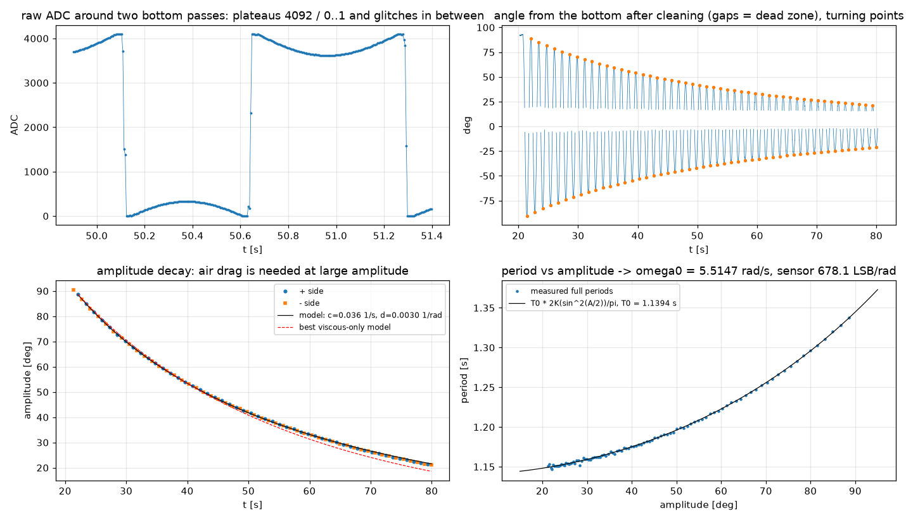

# 02 物理建模与参数辨识

## 2.1 坐标与符号约定（全软件统一）

- $x$：小车位置 [m]，以导轨中点为 0，**正方向 = 电机正速度指令使小车运动的方向**（docs/05 第 4 步实测定义）。
- $\theta$：摆角 [rad]，**从竖直向上量起**，杆向 $+x$ 一侧倾斜时为正。下垂位置 $\theta=\pm\pi$。
- $a=\ddot x$：小车加速度 [m/s²]，即控制输入。
- $m, l_c, J$：摆杆质量、质心到支点距离、对支点的转动惯量；$M$：小车（含电位器与支架）质量。

## 2.2 拉格朗日推导

摆杆质心坐标 $x_p=x+l_c\sin\theta,\ y_p=l_c\cos\theta$。动能与势能：

$$
T=\tfrac12 (M+m)\dot x^2+m l_c\cos\theta\,\dot x\dot\theta+\tfrac12 J\dot\theta^2,\qquad
V=m g l_c\cos\theta .
$$

对 $\theta$ 的欧拉–拉格朗日方程，并加入支点粘性摩擦 $b\dot\theta$ 与库仑摩擦 $T_c\,\mathrm{sgn}\,\dot\theta$：

$$
J\ddot\theta + m l_c\cos\theta\,\ddot x - m g l_c\sin\theta = -b\dot\theta - T_c\,\mathrm{sgn}(\dot\theta).
$$

对 $x$ 的方程给出皮带需要施加的水平力：

$$
F=(M+m)\ddot x + m l_c\left(\ddot\theta\cos\theta-\dot\theta^2\sin\theta\right).
$$

## 2.3 运动学驱动模型（本平台的核心建模决策）

闭环步进电机经同步带刚性驱动很轻的小车（约 120 g）。只要电机不失步（闭环驱动器保证），小车运动就由指令决定，与摆杆的反作用力基本无关。因此**把小车加速度 $a$ 作为输入**，$x$ 方程退化为 $\ddot x=a$，只剩摆杆方程。两边除以 $J$：

$$
\boxed{\ \ddot\theta=\alpha\sin\theta-\beta\cos\theta\,a-c\,\dot\theta-\gamma\,\mathrm{sgn}(\dot\theta)\ }
$$

$$
\alpha=\frac{m g l_c}{J}=\omega_0^2,\qquad
\beta=\frac{m l_c}{J}=\frac{\alpha}{g}=\frac{1}{L_{eq}},\qquad
c=\frac{b}{J},\qquad \gamma=\frac{T_c}{J}.
$$

**物理意义**：
- $\omega_0$ 是摆杆**下垂**时的小角度自然角频率，用秒表就能测；
- $L_{eq}=g/\omega_0^2$ 是“等效单摆长度”；
- 质量本身不进入控制设计，只用于核算电机负载（2.8 节）。

这一结论值得让学生亲手验证：同一根杆，换一个更重的小车，控制器完全不用改；换一个配重头，只需重测周期。

## 2.4 由几何估算参数

测量值：钢管 Ø8 mm、壁厚 1 mm（内径 6 mm）、长 50 cm，在距**下端** 12 cm 处卡住作为转轴（照片中杆在导轨下方露出一小段，与此吻合）；铝合金配重头长 3 cm、外径 2 cm、中孔 1 cm，套在上端。密度取钢 7850 kg/m³、铝 2700 kg/m³。

| 部件 | 质量 | 质心（支点以上） | 对支点惯量 |
|---|---|---|---|
| 上段钢管 38 cm | $\lambda\cdot0.38=65.6$ g | +19.0 cm | $\tfrac13 m L^2=3.158\times10^{-3}$ |
| 下段钢管 12 cm | 20.7 g | −6.0 cm | $0.099\times10^{-3}$ |
| 铝配重头 | 19.1 g | +36.5 cm | $m r^2+$自身 $=2.547\times10^{-3}$ |
| **合计** | **$m=105.4$ g** | **$l_c=17.26$ cm** | **$J=5.80\times10^{-3}\ \mathrm{kg\,m^2}$** |

其中钢管线密度 $\lambda=\rho\,\pi(r_o^2-r_i^2)=0.1726$ kg/m。由此

$$
\omega_0=\sqrt{\frac{m g l_c}{J}}=5.546\ \mathrm{rad/s},\qquad T_0=\frac{2\pi}{\omega_0}=1.1330\ \mathrm{s},\qquad L_{eq}=31.9\ \mathrm{cm}.
$$

（命令：`python -m pendulum_lab params`）

## 2.5 由摆动试验辨识：大振幅修正是关键

实测：把杆拉到 90° 释放，20 个周期用时 24.85 s，振幅衰减到约 50°。

**错误做法**：$T_0=24.85/20=1.2425$ s。这把大振幅效应当成了参数误差，$\omega_0$ 会偏小 9 %，设计出的控制器就是错的。

**正确做法**：单摆振幅为 $A$ 时的精确周期是

$$
T(A)=T_0\,\frac{2K\!\left(\sin^2\frac{A}{2}\right)}{\pi},
$$

$K(\cdot)$ 为第一类完全椭圆积分（参数 $m=k^2$）。$A=90^\circ$ 时比值为 1.1803，$A=50^\circ$ 时为 1.0498。振幅在衰减，所以总时间要按每个半周期的振幅累加：

$$
t_{\text{总}}=\sum_{j=0}^{2N-1}\frac{T_0}{2}\,\frac{2K\!\left(\sin^2\frac{\bar A_j}{2}\right)}{\pi},\qquad \bar A_j=\tfrac12(A_j+A_{j+1}).
$$

**振幅序列由能量平衡给出**（对每个半周期积分 $\dot E=-c\dot\theta^2-\gamma|\dot\theta|$，$E=\tfrac12\dot\varphi^2+\alpha(1-\cos\varphi)$，$\varphi$ 从下垂位置量起）：

$$
\alpha\left(\cos A_j-\cos A_{j+1}\right)=-c\,S(\bar A_j)-\gamma\,(A_j+A_{j+1}),\qquad
S(A)=\sqrt{2\alpha}\int_{-A}^{A}\!\sqrt{\cos\varphi-\cos A}\,d\varphi .
$$

它对 $(c,\gamma)$ **线性**，对库仑摩擦是精确的。注意：用线性振子公式 $A_{j+1}=rA_j-d$ 在大振幅下有偏，因为回复力矩是 $\alpha\sin\varphi$ 而不是 $\alpha\varphi$。开发中实测过这个偏差：仅用线性公式时，纯库仑数据被错误地拆成了一半粘性、一半库仑。

**结果**（`python -m pendulum_lab identify`）：

| 摩擦模型 | $\omega_0$ [rad/s] | $T_0$ [s] | 阻尼 |
|---|---|---|---|
| 纯粘性 | 5.5518 | 1.1317 | $c=0.0435\ \mathrm{s^{-1}}$（$\zeta=0.0039$） |
| 纯库仑 | 5.5777 | 1.1265 | $\gamma=0.208\ \mathrm{rad/s^2}$（$T_c=1.2$ mN·m） |
| 几何估算 | 5.5455 | 1.1330 | — |

**解读**：

1. 实测 $T_0$ 与几何估算相差 0.1–0.6 %，同时印证了“支点距下端 12 cm、配重在上端”的几何假设。
2. 用拟合参数重新积分非线性 ODE，第 20 个周期恰好在 24.851 s 回到 50.00°（自动测试 `test_summary_fit_reproduces_stopwatch_measurement`）。
3. 只有首末两个振幅时，粘性和库仑**无法区分**。库仑解给出 $T_c=1.2$ mN·m，与电位器手册“旋转力矩 < 1 mN·m”同量级，说明摩擦主要来自电位器本身。要区分两者，请用 `scripts/record_potentiometer.py` 记录完整衰减曲线，再运行 `identify --csv`（05 章第 3 步），拟合会同时给出 $c$ 与 $\gamma$。本装置要用**单侧整周期**方法（A1），原因见 03 章 8.1。
4. 库仑摩擦在直立点形成一个“粘滞带”：当 $|\alpha\theta|<\gamma$，即 $|\theta|<\gamma/\alpha=0.39^\circ$ 时，重力矩克服不了静摩擦。它是小幅极限环的来源之一（实验 8）。

## 2.6 线性化模型

在直立点 $\theta=0$ 附近，$\sin\theta\approx\theta,\ \cos\theta\approx1$，忽略库仑项：

$$
\dot{\mathbf{s}}=A\mathbf{s}+B a,\quad
\mathbf{s}=\begin{bmatrix}x\\ v\\ \theta\\ \omega\end{bmatrix},\quad
A=\begin{bmatrix}0&1&0&0\\0&0&0&0\\0&0&0&1\\0&0&\alpha&-c\end{bmatrix},\quad
B=\begin{bmatrix}0\\1\\0\\-\beta\end{bmatrix}.
$$

传递函数：

$$
\frac{\Theta(s)}{A(s)}=\frac{-\beta}{s^2+c\,s-\alpha},\qquad \frac{X(s)}{A(s)}=\frac{1}{s^2}.
$$

开环极点：$0,0$（小车双积分）与 $s=-\tfrac c2\pm\sqrt{\tfrac{c^2}{4}+\alpha}\approx\pm5.50\ \mathrm{s^{-1}}$（实测 $\omega_0=5.5147$，2.10 节）。不稳定极点 $p=+5.50$ 对应倍增时间 $\ln2/p=126$ ms：杆每 126 ms 偏差翻倍。

可控性矩阵 $[B,AB,A^2B,A^3B]$ 满秩（$\beta\ne0$），系统完全可控。

**执行器滞后扩展**：驱动器速度环视为一阶滞后 $\dot v=(v_c-v)/\tau_v$，PC 端积分 $\dot v_c=a_{cmd}$，状态扩展为 $[x,v,\theta,\omega,v_c]$：

$$
\dot\omega=\alpha\theta-\beta\,\frac{v_c-v}{\tau_v}-c\,\omega .
$$

`model/dynamics.py::linear_model(p, actuator_tau)` 同时给出两种形式。

## 2.7 角度传感器模型（WDD35D4 + 12 位 ADC）

### 2.7.1 标定

读数 $\text{ADC}\in[0,4095]$，满量程 3.3 V（1966 → 1584 mV，与 VOFA+ 显示一致）。电位器与 ADC 参考同为 3.3 V 时是**比例式**接法，电源波动自动抵消，建议保持这种接法。

$$
\theta=s\,\frac{\text{ADC}-\text{ADC}_{up}}{k},\qquad
k=\frac{\text{ADC}_{bottom}-\text{ADC}_{up}}{\pi}.
$$

最初用下垂读数 4092 算出 $k=(4092-1966)/\pi=676.7$ LSB/rad。2026-09-27 的实录（2.10 节）表明，**本装置的下垂读数被电位器端点截断了**：真正的最低点位于死区内 0.5°，按线性外推对应读数 4098.3。用它重算 $k=(4098.3-1966)/\pi=678.7$。另一条独立途径是周期—振幅关系，给出 $k=678.1\pm0.8$，两者一致。**软件默认值已改为 678.1**。手册值（电气角 345° 对应 4095 LSB）为 680.1。

所以在本装置上，下垂位置**不能**直接作为 180° 的标定参考。`calibrate-angle` 和 GUI 标定助手检测到下垂读数落在端点（> 4075）时，会自动改用摆动辨识得到的斜率。直立读数仍然用铅垂线对准来测。

**分辨率**：$1/k=1.475$ mrad $=0.0845^\circ$/LSB。静止时噪声（MAD）为 1.5 LSB。

### 2.7.2 死区位置：一个重要的硬件发现

电位器电气行程 345°，机械 360°，剩下 **15° 是死区**（滑片离开电阻带）。按读数换算滑片在电阻带上的位置：

- 直立：$1966/4095\times345^\circ=165.6^\circ$，正好在行程**中部**；
- 下垂：$4092/4095\times345^\circ=344.7^\circ$，距离行程**末端只有 0.3°**。

结论：

- **平衡控制完全不受影响**：直立点两侧各有约 ±165° 的线性区。
- **下垂位置本身就在死区里**（实测，2.10 节）：向一侧转 0.5° 以内读数就停在 4092 附近；另一侧要转过 13.9° 才从 0 重新出现。滑片跨越缝隙时会读出 1–5 个任意值的**毛刺**。自由摆动辨识必须先剔除毛刺，再把两侧读数映射到同一个角度坐标（`model/swing_analysis.py`）。
- **起摆（swing-up）要反复经过下垂位置**，必须跨越死区预测角度（`SwingEstimator` 已实现），所以起摆目前只建议在仿真中教学。若将来要在实物上起摆，可把电位器相对杆转过约 90°，使死区落在水平附近（杆快速经过的位置），代价是直立点离开量程中心，并需重新标定。
- 平衡运行时，安全监督把 ADC < 20 或 > 4075 判为故障（杆已倒或读数异常）。

## 2.8 电机负载核算

小车 + 电位器 + 支架约 $M=0.12$ kg，摆杆 $m=0.105$ kg。以峰值加速度 $a=5$ m/s² 计：

$$
F\approx(M+m)a=1.13\ \mathrm{N}.
$$

同步带轮半径待标定（05 章第 4 步，驱动器实时位置 51200 计数/圈）。以常见 GT2 20 齿（节圆半径 6.37 mm，每转 40 mm）估算：负载转矩 $Fr=7.2$ mN·m，转子惯量（约 $5\times10^{-6}$ kg·m²）的加速转矩 $J_r a/r\approx4$ mN·m，合计约 11 mN·m。42 步进电机保持转矩通常为 0.3–0.5 N·m，余量超过一个数量级。

- 速度：0.5 m/s 对应 750 rpm。12 V 供电时高速转矩会下降，但仍够用。
- 请在 `motor-step` 测试中确认驱动器没有报堵转。

**供电**：先前截图中总线电压 4.47 V，已查明是外接 12 V 开关未打开。手册规定输入 12–32 V。请用万用表测量**运动时**的 V+/GND 电压，确认带载压降后仍 ≥ 12 V。充电头式电源在电流阶跃时可能跌落或打嗝保护，建议换成额定 ≥ 3 A 的 12 V 或 24 V 开关电源。

## 2.9 同步带间隙

皮带“不是很紧”会引入间隙（play）：电机换向时小车先停住，直到齿隙被吃掉。对控制而言，这相当于一个死区加一次速度突变。突变时小车速度跳变 $\Delta v$，摆杆角速度随之跳变 $\Delta\omega=-\beta\cos\theta\,\Delta v$。

在平衡点附近，小车正在做小幅往复运动，间隙会被**反复穿越**，典型后果是持续的小幅极限环。数字孪生可以设置间隙（GUI“皮带间隙 [mm]”），学生能直接看到极限环随间隙增大。**建议把皮带张紧到手指按压几乎不变形**，这是提升实物效果最便宜的方法。

## 2.10 第一次实测数据的辨识（2026-09-27）

数据：`record_potentiometer.py` 录制。先静止下垂 3 s，再从 90.5° 松手，录 60 s，采样率 200.0 Hz（时间戳线性拟合残差 ±0.5 ms）。文件存为 `tests/data/swing_20260927_151631.csv`，已写入回归测试。

### 2.10.1 原始信号的三个特点

左上图是两次经过最低点时的原始读数。

1. **两侧读数不连续**：一侧从 4092 往下（到 3030，约 −89°），另一侧从 0 往上（到 910，约 +92°）。原因是滑片绕过了电阻带两端。
2. **两端平台**：经过最低点时，读数先停在约 4092（高端端子），再停在 0–1（低端端子）。
3. **毛刺**：滑片跨越缝隙时出现 1–5 个任意值，例如 `… 8 1 1 1029 2129 4091 …`。

第 3 点正是旧方法 A1/A2 失败（给出 $\omega_0=11.8$）的根本原因。毛刺落在读数中段，换算成角度接近“直立”，极值搜索把它们当成摆动的转折点，每个周期多出好几个假极值，周期被算短一半左右。

### 2.10.2 处理流程（方法 A，`model/swing_analysis.py`）

1. **展开**：以静止读数 $h$ 为中心，$u=h+\big((\text{ADC}-h+N/2)\bmod N\big)-N/2$，其中 $N=4096\cdot360/345$，并记下每个样本是否绕过了一圈（$w\in\{0,1\}$）。
2. **剔除**：去掉读数在 $[8,4087]$ 以外的样本（端子平台），以及与 9 点滑动中位数相差 > 40 LSB 的样本（毛刺）；无效区再向两边各扩 2 个样本。
3. **转折点**：每段连续有效数据里用四次多项式局部拟合找极值，并丢掉手扶阶段（平台 > 0.15 s）。
4. **传感器自标定（偏置）**：阻尼使相邻两个转折点的振幅 $A_j\to A_{j+1}$ 逐渐减小，最低点时刻取两个四分之一周期的平均：
   $$
   t_b=\tfrac12\Big[\big(t_j+\tfrac{T(A_j)}{4}\big)+\big(t_{j+1}-\tfrac{T(A_{j+1})}{4}\big)\Big].
   $$
   每个样本的精确摆角由椭圆函数给出：
   $$
   \varphi(\tau)=2\arcsin\!\big(\kappa\,\mathrm{sn}(\omega_0\tau\,|\,\kappa^2)\big),\qquad \kappa=\sin\tfrac{A}{2},
   $$
   其中能量（从而 $\kappa$）在半周期内按时间线性插值。对所有样本做线性最小二乘
   $$
   \text{ADC}=b+K\varphi-N_{\rm eff}\,w ,
   $$
   得到最低点读数 $b$ 和“绕一圈”的有效读数长度 $N_{\rm eff}$，由此得到死区的位置和宽度。
5. **传感器自标定（斜率）与 $\omega_0$**：在上一步的回归里，$K$ 几乎不可辨识。原因是最低点附近读数的变化率为 $K\cdot2\omega_0\sin\frac{A}{2}$，而 $A=(u_p-b)/K$，$K$ 在一阶近似下被约掉了。在数字孪生上直接回归 $K$，结果是 $K$ 低 0.6 %、$\omega_0$ 高 0.2 %，两者沿一条“山脊”互相补偿。所以 $K$ 改由**周期—振幅关系**确定：
   $$
   T_{\rm full}(A)=T_0\cdot\frac{2}{\pi}K_{\rm ell}\!\big(\sin^2\tfrac{A}{2}\big),\qquad A=A(K).
   $$
   $K$ 错了，单周期换算出的 $T_0$ 会随振幅系统倾斜，因为 $f(A)-1\approx A^2/16$。所以 $(T_0,K)$ 可以用非线性最小二乘同时拟合。前提是振幅范围足够宽，这次是 91°→21°。右下图中实测周期与理论曲线在整个范围内重合。
6. **阻尼**：用半周期能量平衡。三种损耗机理对应三个回归量，都对系数线性：
   $$
   \alpha(\cos A_{j+1}-\cos A_j)=c\,S_1+\gamma\,(A_j+A_{j+1})+d\,S_3,\qquad
   S_1=\!\int\!\dot\varphi^2dt,\quad S_3=\!\int\!|\dot\varphi|^3dt=4\alpha(\sin A-A\cos A).
   $$
   用非负最小二乘拟合 7 种组合，按 AIC 选择模型，更复杂的模型必须让 AIC 至少降低 2 才采用。

### 2.10.3 结果

| 量 | 值 | 说明 |
|---|---|---|
| $\omega_0$ | **5.5147 ± 0.0008 rad/s**（$T_0=1.1394$ s） | 只用 + 侧 5.5150，只用 − 侧 5.5149 |
| 方法 B（状态变量滤波 + 最小二乘） | 5.5094 rad/s（−0.10 %） | 独立方法，一致 |
| 阻尼模型 | 粘性 + 空气阻力：$c=0.0363$ 1/s，$d=0.00297$ 1/rad，$\gamma\approx0$ | 只用粘性阻尼时 AIC 高 15.5；大振幅段明显偏离（左下图红虚线） |
| 电位器斜率 $K$ | 678.1 ± 0.8 LSB/rad（电气角 346.0°） | 手册 345° |
| 最低点读数 | 4098.3（高端饱和点在最低点 −0.5°，低端起点在 +13.9°） | 有效死区宽 14.2° |
| 外推的直立读数 | 1967.9 | 您用铅垂线测得 1966，相差 0.16° |
| 几何估算 | $\omega_0=5.55$ | 实测低 0.6 %，在几何尺寸公差内 |

**空气阻力的物理核算**：钢管 Ø8 mm、铝头 Ø20×30 mm，按 $C_d\approx1.1$ 估算，空气阻力矩约 $4.8\times10^{-5}\,\dot\varphi^2$ N·m。除以 $J=5.8\times10^{-3}$ kg·m²，得 $d\approx0.008$ 1/rad，与拟合值（单独拟合 0.0096，与粘性项联合拟合 0.0030）同一量级。在平衡点附近角速度很小，空气阻力可以忽略；它只影响大摆幅的辨识。

**秒表法复核**：同一次摆动中，20 个整周期实录用时 24.82 s，您的秒表是 24.85 s，**计时完全正确**。秒表法当时给出 5.55 rad/s，偏差来自两处：

1. 目测的终止振幅是 50°，实录是 45.8°。按 90.9°→45.8° 重算，粘性模型给出 5.527 rad/s。
2. 剩下 0.2 % 的偏差来自阻尼模型：两个数据点无法区分粘性阻尼和空气阻力。

这是很好的课堂素材：**测量值（时间）准，模型输入（振幅）和模型结构（阻尼形式）不准**。

**方法 B 的一个离散化陷阱（已修正）**：状态变量滤波器 $F(s)=\omega_f^2/(s^2+2\zeta\omega_f s+\omega_f^2)$ 的二阶导数输出 $s^2F$ 含有直通项 $\omega_f^2u$。采样点之间插值的平均误差为 $-T_s^2\ddot u/12$，经过这个直通项被放大 $\omega_f^2$ 倍，又在采样时刻被同步采样，结果对**所有**低频信号都产生一个固定的相对误差 $-(\omega_fT_s)^2/12$。在 $T_s=5$ ms、$\omega_f=60$ rad/s 时，$\alpha$ 偏低 0.75 %（实测 0.74 %）。零阶保持和一阶保持都有这个问题；除以 $1-(\omega_fT_s)^2/12$ 即可精确补偿（`SVF(hold="foh")`，测试 `test_foh_svf_has_no_sampling_bias`）。

**方法 B 的阻尼项不可信**：死区恰好切掉了每次经过最低点时速度最大的那一段，剩下的数据里 $\dot\varphi$、$\mathrm{sgn}\,\dot\varphi$、$\dot\varphi|\dot\varphi|$ 三个回归量高度相关，所以 B 的 $c$、$\gamma$、$d$ 会出现负值。方法 A 用能量平衡对整个半周期积分，不需要看到最低点，所以不受影响。

这些实测值已设为软件默认值（`config.py::MEASURED_PLANT`），数字孪生的传感器斜率也同步更新。控制器按新 $\omega_0$ 重新设计后，变化很小：不稳定极点从 5.53 变为 5.50 s⁻¹。
