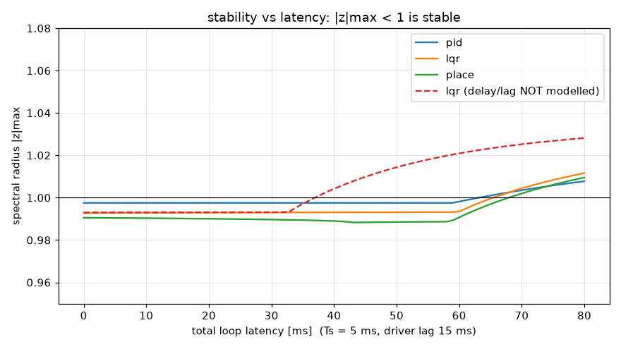
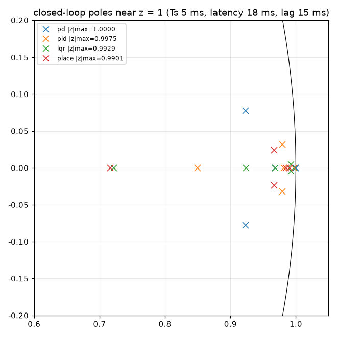
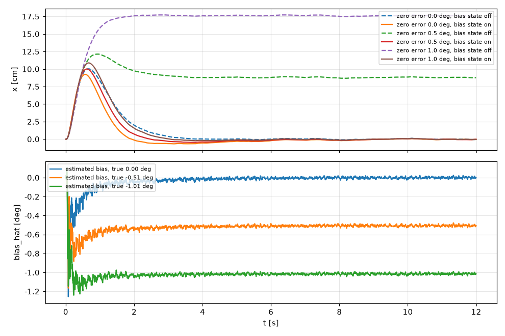
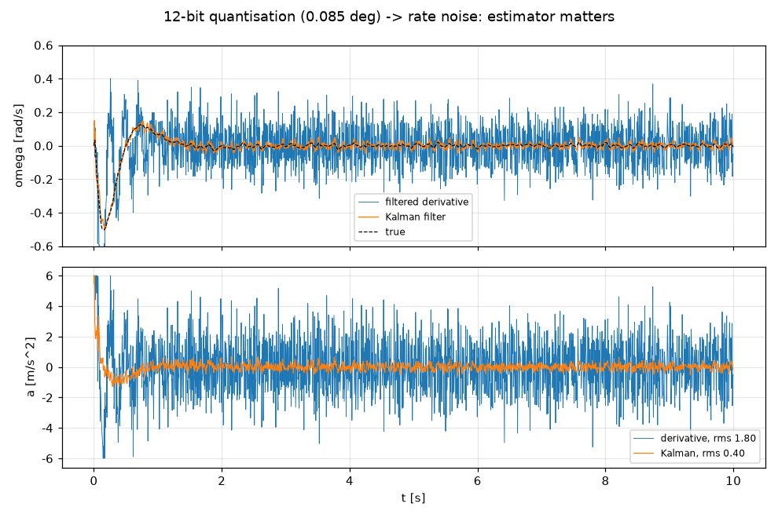

# 03 控制算法与参数辨识：原理、设计与效果比较

本章所有数字都可复现：

- 增益与极点：`python -m pendulum_lab design`
- 仿真比较：`python -m pendulum_lab compare`
- 系统性基准：`python examples/benchmark.py`（结果写入 [benchmark_results.md](benchmark_results.md)）
- 配图：`python examples/make_teaching_figures.py`

记号见 02 章：$\alpha=\omega_0^2=30.8\ \mathrm{s^{-2}}$，$\beta=\alpha/g=3.14\ \mathrm{m^{-1}}$，控制输入是小车加速度 $a$。

## 1 计算机控制的共同框架

### 1.1 采样、保持、延迟

控制律每 $T_s=5$ ms 计算一次，输出经零阶保持（ZOH）作用到对象。从传感器采样到小车真正开始加速的总延迟为 $\tau$（传感器传输 + 计算 + 指令传输 + 驱动器反应）。令 $\tau=dT_s+fT_s$（$d$ 为整数，$0\le f<1$）。对连续模型 $\dot s=As+Ba$ 精确积分一个采样周期：

$$
s_{k+1}=\Phi s_k+\Gamma_d\,a_{k-d}+\Gamma_{d+1}\,a_{k-d-1},\qquad
\Phi=e^{AT_s},
$$

$$
\Gamma_d=\int_0^{(1-f)T_s}\!e^{A\eta}d\eta\,B,\qquad
\Gamma_{d+1}=e^{A(1-f)T_s}\!\int_0^{fT_s}\!e^{A\eta}d\eta\,B .
$$

把过去的输入 $a_{k-1},\dots,a_{k-d-1}$ 并入状态，得到**无延迟的增广系统**。这是所有模型设计（LQR、极点配置、卡尔曼滤波）和闭环分析（`control/analysis.py`）的基础。分数延迟也精确处理，所以“延迟裕度”可以精确到 0.1 ms。

### 1.2 执行器：加速度 → 速度指令

PC 把控制器输出的加速度积分成速度指令，交给驱动器的速度环：

$$
v_{cmd,k+1}=\mathrm{sat}_{v_{max}}\!\left(v_{cmd,k}+\mathrm{sat}_{a_{max}}(a_k)\,T_s\right),\qquad
a^{eff}_k=\frac{v_{cmd,k+1}-v_{cmd,k}}{T_s}.
$$

送给状态估计器和 LQR 历史输入的是**有效加速度** $a^{eff}$，因此饱和时不会发生积分饱和（windup）。驱动器速度环视为一阶滞后 $\tau_v$（默认 15 ms，实测见 05 章第 5 步）。

### 1.3 稳定判据

增广闭环矩阵的谱半径 $\rho=\max|z_i|<1$ 为稳定。线性化只在直立附近有效，所以仿真里还有非线性、饱和、量化，两者要对照看。

## 2 角度 PD：最直观，但不完整

$$
a=K_p\theta+K_d\dot\theta .
$$

代入 $\ddot\theta=\alpha\theta-\beta a-c\dot\theta$：

$$
\ddot\theta+(c+\beta K_d)\dot\theta+(\beta K_p-\alpha)\theta=0
\quad\Longrightarrow\quad
K_p>\frac{\alpha}{\beta}=g .
$$

**物理含义**：杆倾斜 $\theta$ 时，只有小车以 $a=g\theta$ 加速才能“撑住”它；要把杆推回来，小车必须加速得比这更猛。按期望极点 $\omega_n,\zeta$ 设计：

$$
K_p=\frac{\alpha+\omega_n^2}{\beta},\qquad K_d=\frac{2\zeta\omega_n-c}{\beta}.
$$

默认 $\omega_n=8,\ \zeta=1$，得 $K_p=30.2$、$K_d=5.08$。

**缺陷（必须让学生看到）**：小车状态 $(x,v)$ 不进入控制律，闭环在 $z=1$ 处有双极点。即使杆稳住了，小车也以恒定速度漂走；任何角度零点偏差 $\delta$ 都会让小车以 $g\delta$ 持续加速。仿真中 PD 在所有场景下都撞到软限位（基准表第一列）。

## 3 串级 PID：时标分离，以及它的硬约束

- 内环（角度）：$a=K_p(\theta-\theta_{ref})+K_i\!\int(\theta-\theta_{ref})+K_d\dot\theta$
- 外环（位置）：$\theta_{ref}=-\mathrm{sat}\big(k_x(x-x_{ref})+k_v v\big)$

**准静态设计**：内环足够快时 $\theta\approx\theta_{ref}$。杆以倾角 $\theta$ 平衡时小车加速度为 $a=g\theta$，所以外环看到的是

$$
\ddot x=-g\,(k_x x+k_v v)\quad\Rightarrow\quad gk_x=\omega_o^2,\ \ gk_v=2\zeta_o\omega_o .
$$

**非最小相位**：要让小车向左回来，杆必须先向左倾，而这要求小车先向右动。所以小车总是先“反向”再返回（compare 图中 x 曲线的第一个峰）。

**时标分离不是经验，而是硬约束**。把串级展开成状态反馈 $a=k_1x+k_2v+k_3\theta+k_4\omega$，闭环特征多项式为

$$
s^4+(\beta k_4-k_2)s^3+(\beta k_3-\alpha-k_1)s^2+\alpha k_2 s+\alpha k_1 .
$$

其中 $k_2=K_pk_v$、$k_4=K_d$。$s^3$ 系数为正要求

$$
\boxed{K_p k_v<\beta K_d}
$$

即外环速度增益必须小于内环阻尼。开发中实测过：按“外环慢 6 倍”的直觉取 $\omega_o=2$ 时闭环不稳定（$\rho=1.021$）。默认取 $\omega_o=0.8$，此时延迟裕度 63 ms。

## 4 LQR：最优状态反馈

在增广离散模型 $\xi_{k+1}=F\xi_k+Ga_k$ 上最小化

$$
J=\sum_k \xi_k^\top Q\xi_k+r\,a_k^2,\qquad
Q=\mathrm{diag}(q_x,q_v,q_\theta,q_\omega,0,\dots),
$$

由离散 Riccati 方程 $P=F^\top PF-F^\top PG(r+G^\top PG)^{-1}G^\top PF+Q$ 得 $a=-K\xi$，$K=(r+G^\top PG)^{-1}G^\top PF$。

**Bryson 法则**：$q_i=1/(\text{允许偏差}_i)^2$，$r=1/a_{max}^2$。默认 $Q=\mathrm{diag}(20,5,200,5)$、$r=0.2$，含义约为：$x$ 允许 22 cm、$\theta$ 允许 4°、$a$ 约 2.2 m/s²。

**延迟与滞后感知**：$\xi$ 包含驱动器速度环状态 $v_c$ 和 4 个历史输入。默认增益：

| 状态 | $x$ | $v$ | $\theta$ | $\omega$ | $v_{cmd}$ | $a_{k-1..k-4}$ |
|---|---|---|---|---|---|---|
| $-K$ | 9.41 | 40.5 | 79.5 | 14.0 | −28.8 | −0.12…−0.14 |

历史输入项是“预测补偿”：已经发出但尚未生效的指令，会在未来改变状态，控制器提前把它算进去（离散版的 Smith 预估思想）。

**效果**（基准表、延迟扫描图）：

- 延迟裕度：感知设计 65 ms，朴素设计 37 ms；
- 35 ms 延迟下，朴素 LQR 的加速度 RMS 从 0.74 升到 1.39 m/s²（感知设计仅 0.56），接近振荡边缘；
- 线性不稳定时，饱和把发散变成剧烈的极限环。开发测试中，朴素高增益设计在 41 ms 延迟下出现 2.4° RMS 的持续摆动。

**LQI**：在 $\xi$ 中加入 $\int x\,dt$（配置 `q_integral`）可消除小车稳态偏差。但对角度零点偏差，下文的零偏状态估计更好。

## 5 极点配置

指定 4 个物理模态的连续极点 $s_i$（默认 $-7\pm5j,-3,-2$），映射为 $z_i=e^{s_iT_s}$。驱动器滞后状态配到 $e^{-T_s/\tau_v}$，延迟状态配到 $z=0$（有限拍）。然后用 Ackermann 公式

$$
K=e_n^\top\,\mathcal C^{-1}\,\varphi(F),\qquad \mathcal C=[G,FG,\dots,F^{n-1}G].
$$

教学对照：LQR 通过权重“间接”决定极点；极点配置则直接指定动态。极点越快增益越大，噪声放大越明显，延迟裕度越小。数值说明：$z=0$ 的三重根只能复现到约 $\varepsilon^{1/3}\approx10^{-4}$，这是重根的固有敏感性，不是程序错误。

## 6 状态估计：量化噪声下如何得到角速度

12 位 ADC 的量化为 1.478 mrad。以 200 Hz 直接差分，单个 LSB 的跳变就是 0.3 rad/s 的角速度噪声，乘以 $K_\omega\approx14$ 后约 4 m/s² 的指令噪声。

**滤波微分**（Tustin）：$\hat\omega=\dfrac{s}{\tau s+1}\theta$，截止 20 Hz。简单，但仍有较大噪声和相位滞后。

**卡尔曼滤波 + 零偏状态**：模型 $[x,v,\theta,\omega,b]$，量测为 $\theta_{meas}=\theta+b$ 与 $x_{enc}$，输入为（延迟后的）有效加速度。

- **零偏 $b$ 可观**：杆以真实角度 $\theta$ 平衡时小车以 $g\theta$ 加速，编码器能看到这个加速度，所以 $\theta$ 与 $b$ 能被区分。
- 初值协方差取 $\sigma_{\theta,0}=\sigma_{b,0}=3^\circ$。$t=0$ 时只能测到 $\theta+b$，两者先验不确定度必须相当；取 $\sigma_{\theta,0}$ 很小会把偏差错归给 $\theta$，实测导致 1° 误差时串级 PID 撞轨。

**零点误差的代价**（没有零偏状态时）：稳态满足 $K_x x+K_\theta(\theta+\delta)=0$，而 $\theta\to0$，所以

$$
x_{ss}=-\frac{K_\theta}{K_x}\,\delta\approx-15\ \text{cm/度}.
$$

0.5° 误差就让小车偏 8.8 cm，1° 误差时每种算法都撞轨（基准表“zero error, no bias state”一行）。有零偏状态时 ±2° 都能自动补偿：估计值在约 1.5 s 内收敛到真值，小车回到中心。

## 7 非线性与非理想因素（数字孪生实测）

| 因素 | 现象 | 机理 | 对策 |
|---|---|---|---|
| 执行饱和 | 大延迟时出现极限环而不是发散 | 饱和降低等效增益 | 延迟感知设计；限幅 |
| 皮带间隙 2 mm | 角度 RMS 0.03°→0.3–0.7° | 换向时小车先停，速度突变 $\Delta\omega=-\beta\Delta v$ | 张紧皮带 |
| 库仑摩擦 $\gamma=0.2$ | 约 0.3 Hz 慢极限环，小车峰峰值 8 cm | 直立附近 $|\theta|<\gamma/\alpha=0.39^\circ$ 形成粘滞带，相当于游走的零偏，外环来回“追” | 滤波微分的噪声能起颤振作用打破粘滞（RMS 0.04°，代价是加速度噪声 1.8 m/s²）；速度摩擦补偿无效（杆不动时 $\hat\omega\approx0$）。实测 $\gamma$ 后再评估，属研究型实验 |
| ADC 噪声 ×3 | 角度 RMS 翻倍 | 噪声经 $K_\theta$ 放大 | 卡尔曼滤波 |
| 电位器死区 | 只影响下垂附近 | 滑片离开电阻带 | 平衡时视为故障；辨识时剔除 |

## 8 参数辨识：方法、坑与比较

### 8.1 开环：自由摆动（推荐，精度最高）

完整推导和实测结果见 02 章 2.10 节。这里只比较方法本身。

**A. 转折点 + 能量平衡（推荐，`model/swing_analysis.py`）**：

- 先剔除死区平台和毛刺，每段有效数据取一个转折点 $(t_j,A_j)$；
- **传感器用摆动自身标定**：
  - 最低点读数 $b$ 和绕圈长度 $N_{\rm eff}$，由“最低点在两个转折点正中（按阻尼修正）”这一时间关系回归得到；
  - 斜率 $K$ 由周期—振幅关系 $T(A)=T_0\,2K_{\rm ell}(\sin^2\tfrac A2)/\pi$ 得到：$K$ 错了，单周期换算的 $T_0$ 会随振幅倾斜；
- $\omega_0$ 由全部整周期同时拟合；
- 阻尼：半周期能量平衡
  $$
  \alpha(\cos A_{j+1}-\cos A_j)=c\,S_1+\gamma\,(A_j+A_{j+1})+d\,S_3 ,
  $$
  对 $(c,\gamma,d)$ 线性。粘性、库仑、空气阻力三项的 7 种组合用非负最小二乘拟合，按 AIC 选择。

**旧方法 A1/A2 的教训**：旧方法在原始角度上直接找极值。滑片跨越死区时的毛刺被当成转折点，实测数据给出 $\omega_0=11.8$（真值 5.51）。**先理解传感器，再做辨识**：数据清洗和传感器模型往往比拟合算法更重要。

**B. 状态变量滤波（SVF）+ 最小二乘**：用 $F(s)=\omega_f^2/(s^2+2\zeta\omega_f s+\omega_f^2)$ 同时滤波方程两侧，得到

$$
\ddot\varphi_f=-\alpha\,[\sin\varphi]_f-c\,\dot\varphi_f-\gamma\,[\mathrm{sgn}\,\dot\varphi]_f-d\,[\dot\varphi|\dot\varphi|]_f ,
$$

对全部有效样本做线性最小二乘。开发中踩过的四个坑，都有单元测试：

1. **离散化的直通偏差**：$s^2F$ 含直通项 $\omega_f^2u$。采样点之间插值的平均误差 $-T_s^2\ddot u/12$ 被放大 $\omega_f^2$ 倍后同步采样，得到固定的相对误差 $-(\omega_fT_s)^2/12$。在 $T_s=5$ ms、$\omega_f=60$ 时 $\alpha$ 偏低 0.75 %。角度用一阶保持离散化，并除以 $1-(\omega_fT_s)^2/12$ 补偿。零阶保持（用于分段常值的加速度指令）的输出按区间平均配对。
2. **符号回归量的时序**：用滤波后速度的符号会带滤波群延迟，得到负的粘性系数。改用原始信号中心差分的符号。
3. **分段启动瞬态**：死区把数据切成半周段，滤波器必须以“稳态跟踪解” $f_0=u-\tfrac{2\zeta}{\omega_f}\dot u+\tfrac{4\zeta^2-1}{\omega_f^2}\ddot u$ 初始化。
4. **回归量共线**：死区切掉了速度最大的那一段，三个阻尼回归量高度相关。所以 B 的 $\omega_0$ 可信（与 A 差 0.1 %），阻尼项不可信。

### 8.2 闭环：在线 RLS（平衡时实时估计 $\omega_0$）

一般的闭环辨识要同时估 $\alpha$ 和 $\beta$。反馈使 $a\approx K\theta$，两个回归量几乎共线，问题病态。**物理约束 $\beta=\alpha/g$**（对任意刚体摆在运动学驱动下都成立）把问题化为**标量**：

$$
\underbrace{\ddot\theta_f+c\,\dot\theta_f}_{y}=\alpha\,\underbrace{\big[\sin\theta-\cos\theta\,a_{act}/g\big]_f}_{\varphi},
$$

- $a_{act}$ 是按实测延迟与滞后处理过的有效指令；
- $\theta$ 用**测量值减去估计零偏**。不用卡尔曼估计值，因为它由名义模型传播，会把结果拉向名义值；
- 带遗忘因子（0.9997，约 17 s 记忆）的 RLS。

**闭环辨识的三个陷阱（孪生实测）**：

| 情形 | 估计（真值 5.55） | 方差 | 软件处理 |
|---|---|---|---|
| 已知激励：x_ref ±3 cm 方波 | 5.62（约 +1 %） | ±0.05 | 可信，允许更新 |
| 无激励 | 5.98（+8 %） | ±0.14，大 | 收敛判据不满足，不更新 |
| 手推扰动 | 4.53（−18 %） | ±0.02，**看似很可信** | 残差 > 3σ 的样本被剔除；剔除率 > 2 % 就判为不可信，不更新 |

根源：没有外部激励时，回归量主要由噪声经反馈产生，属于“变量含误差”偏差。未测扰动与反馈输入相关，是闭环辨识的经典偏差。**结论：闭环辨识必须有已知的外部激励，而且辨识期间不能人为扰动。**

注意：选样本时“只用 $|\varphi_f|$ 大的样本”看似合理，实则会引入选择偏差（实测 5.24）。软件因此不做这种选择。

### 8.3 自整定（确定性等价）

`update` 模式每 2 s 检查一次：

1. 已知激励在运行；
2. RLS 已收敛（1σ < 1.5 %）；
3. 剔除率 < 2 %；
4. 新 $\omega_0$ 在名义值 ×[0.8, 1.25] 内。

四条都满足时，$\omega_0$ 每次最多改 5 %，随后用新模型重新设计控制器（LQR/PID/极点配置）并更新卡尔曼滤波模型，控制器内部状态保持不变（无扰切换）。

孪生实验（名义值为实测 5.51）：真值 5.0 时，40 s 后设计值为 5.05；真值 6.0 时为 6.05。

### 8.4 辨识方法比较（完整表格由 `examples/benchmark.py` 生成，见[基准结果](benchmark_results.md)）

**实测数据**（2026-09-27，91°→21°，60 s）：

| 方法 | $\omega_0$ [rad/s] | 阻尼 | 评价 |
|---|---|---|---|
| 旧 A1 / A2（原始极值） | 11.80 / 10.75 | – | 毛刺成了假极值，**完全错误** |
| **A 转折点 + 能量平衡** | **5.5147 ± 0.0008** | $c=0.036$，$d=0.0030$（AIC 选出粘性 + 空气阻力） | 两侧分别为 5.5150 / 5.5149 |
| B SVF + 最小二乘 | 5.5094（−0.10 %） | 不可信 | 独立验证 $\omega_0$ |
| 秒表 90°→50°，20 次 24.85 s | 5.552 | $c=0.044$ | 计时准；终止振幅实为 45.8°，改正后为 5.527 |

**数字孪生**（真值已知：$\omega_0=5.55$，$c=0.02$，$\gamma=0.10$，传感器与实物同样有死区和毛刺）：

| 方法 | $\omega_0$ | $c$ | $\gamma$ | 评价 |
|---|---|---|---|---|
| 秒表，$T=t/20$ | 5.03 | – | – | 忽略大振幅周期变长，**偏 9 %** |
| 秒表 + 椭圆积分修正 | 5.54 / 5.56 | 二者不可分 | | 只有两个数，阻尼模型不可辨 |
| 旧 A1 / A2 | 16.7 / 12.0 | | | 被毛刺破坏 |
| **A** | **5.5500** | **0.0198** | **0.1008** | AIC 正确选出“粘性 + 库仑”；$K$ 与真值相差 0.04 % |
| B | 5.545 | 不可信 | | |
| 在线 RLS（有激励） | 5.62 | 固定 | – | 平衡中获得，约 1 % |

模型误差对控制的影响（基准表“model ±10 %”行）：LQR/PID 在 ±10 % 内都能平衡，但 −10 % 时小车行程由 12 cm 增到 16 cm。所以精确辨识主要换来的是**性能与余量**，而不只是“能不能立住”。

## 9 能量起摆（仅仿真）

能量（除以 $J$，直立静止为 0）$e=\tfrac12\omega^2+\alpha(\cos\theta-1)$，$\dot e=-\beta a\,\omega\cos\theta$。取 $a=k\,e\,\omega\cos\theta$，得 $\dot e=-\beta k e(\omega\cos\theta)^2\le0$，$e\to0$，即 Lyapunov 意义下收敛到过直立点的同宿轨道；进入 ±25° 后切换为 LQR 捕获。

仿真中约 7 s 起摆，小车行程 ±22 cm。**出于安全考虑，实物运行不提供起摆**：导轨仅 70 cm、电位器死区在下垂位置旁。GUI 中该算法标注为“仅仿真”，命令行 `run` 不接受它。

## 10 总结：如何选算法

| 需求 | 推荐 |
|---|---|
| 讲清“为什么倒立摆难” | PD：$K_p>g$ 的推导，以及小车漂移 |
| 工程直觉、可手调 | 串级 PID；注意 $K_pk_v<\beta K_d$ |
| 最佳综合性能与鲁棒性 | 延迟与滞后感知 LQR + 带零偏的卡尔曼滤波（实物默认） |
| 讲极点与动态的关系 | 极点配置，与 LQR 对照 |
| 讲计算机控制的本质 | 同一控制器改 $T_s$、延迟、量化、间隙，看稳定裕度 |

完整基准表见 [benchmark_results.md](benchmark_results.md)（每格：末 2 s 角度 RMS / 小车最大行程 / 加速度 RMS）。
